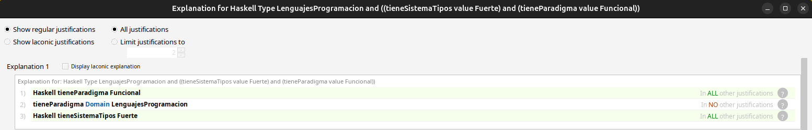
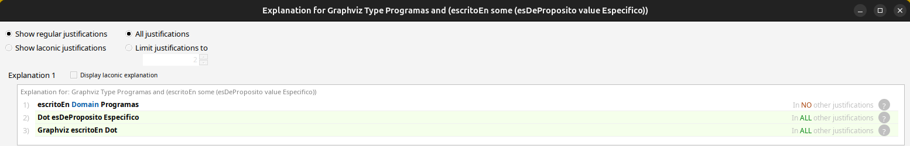

# Lenguajes de Programación

Elegimos la propuesta de lenguajes de programación y, siguiendo las pautas de la metodología de 
desarrollo de ontologías, planteamos algunas preguntas de competencia.

¿Cómo clasificamos lenguajes? ¿Cómo se define un lenguaje tipado? ¿Los lenguajes deben ser clases o individuos?

Teniendo en cuenta las preguntas que elegimos desarrollamos la ontología y elegimos limitarnos a 
los lenguajes y programas como individuos, puesto que no nos interesaba realizar consultas
más específicas sobre posibles miembros de una clase de un lenguaje en particular
(Como podría ser las distintas versiones de un lenguaje, distintas implementaciones dependiendo del compilador, etc...)

## Conceptos Representados

**Lenguajes de programación**: lenguaje formal para programar una serie de instrucciones en forma de algoritmos.

**Implementación de lenguajes**: si son lenguajes interpretados o compilados.

**Manejo de errores**: forma de manejar los errores de un lenguaje (por medio de excepciones o por el sistema de tipos).

**Manejo de memoria**: forma de manejar la memoria de un lenguaje (manual o con garbage collector).

**Nivel de abstracción**: nivel de abstracción del lenguaje máquina.

**Paradigma de programación**: paradigma de un lenguaje (funcional, imperativo, orientado a objetos, etc).

**Propósito del lenguaje**: si el lenguaje es de propósito general o específico.

**Sistemas de tipos**: si un lenguaje tipado tiene tipado fuerte o débil, dinámico o estático.

**Programas**: paquetes de software escritos en algún o algunos lenguajes.

## Diagrama de la ontología

## Esquema de instancias

## Consultas

### Formulación Natural

Elegimos la tercera pregunta de las planteadas, y agregamos algunas similares que
podamos responder con las instancias ingresadas.

- Cuáles programas fueron escritos en más de un lenguaje, donde alguno de los lenguajes es de tipado dinámico?
- Cuáles lenguajes son fuertemente tipados y funcionales?
- Cuáles programas utilizan lenguajes de dominio específico?

### Sintaxis "DL Query"

- Programas
 and ((escritoEn some (tieneSistemaTipos value Dinamico))
 and (escritoEn min 2 LenguajesProgramacion))
- LenguajesProgramacion
 and ((tieneSistemaTipos value Fuerte)
 and (tieneParadigma value Funcional))
- Programas
 and (escritoEn some (esDeProposito value Especifico))

\begin{center}
\includegraphics[width=0.3\textwidth]{images/consulta1.png}
\includegraphics[width=0.3\textwidth]{images/consulta2.png}
\includegraphics[width=0.3\textwidth]{images/consulta3.png}
\end{center}

## Análisis del razonador

Para la primera consulta, el razonador sabe que el programa Git está escrito en los lenguajes C y Python, que estos dos son individuos distintos, y que Python tiene sistema de tipos dinámico, con lo cual Git cumple con las condiciones dadas en la consulta.

En la segunda consulta, el razonador sabe que el paradigma del lenguaje Haskell es funcional y su sistema de tipos es fuerte, por lo cual cumple con las condiciones de la consulta.

En la tercera consulta, el razonador sabe que el lenguaje Dot es de dominio específico y que el programa Graphviz está escrito en Dot, por lo cual cumple la condición de la consulta.

## Fuentes

https://es.wikipedia.org/wiki/Lenguaje_de_programaci%C3%B3n
https://en.wikipedia.org/wiki/Programming_language
https://es.wikipedia.org/wiki/Tipado_fuerte
