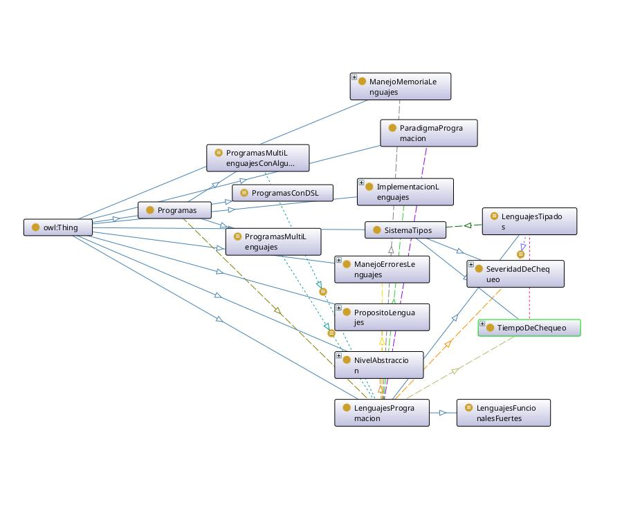
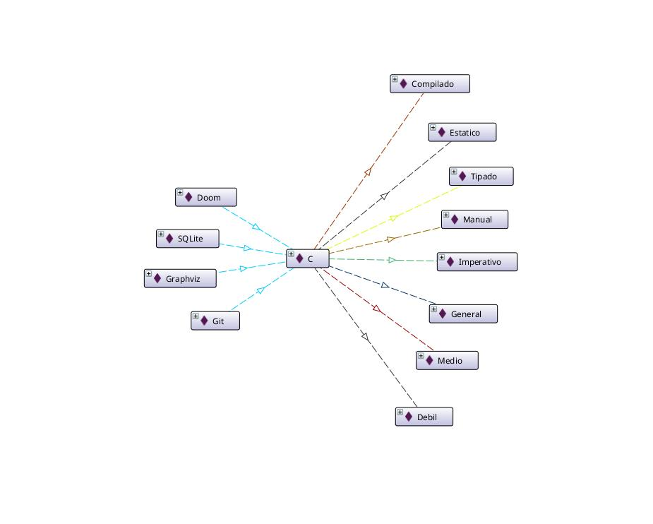

# Lenguajes de Programación

Elegimos la propuesta de lenguajes de programación y, siguiendo las pautas de la metodología de 
desarrollo de ontologías, planteamos algunas preguntas de competencia.

¿Cómo clasificamos lenguajes? ¿Cómo se define un lenguaje tipado? ¿Los lenguajes deben ser clases o individuos?

Teniendo en cuenta las preguntas que elegimos desarrollamos la ontología y elegimos limitarnos a 
los lenguajes y programas como individuos, puesto que no nos interesaba realizar consultas
más específicas sobre posibles miembros de una clase de un lenguaje en particular
(Como podría ser las distintas versiones de un lenguaje, distintas implementaciones dependiendo del compilador, etc...)

No tomamos inspiración de otras ontologías, pero utilizamos como referencia el tutorial de las pizzas para resolver algunas dificultades.

## Conceptos Representados

**Lenguajes de programación**: lenguaje formal para programar una serie de instrucciones en forma de algoritmos.

**Implementación de lenguajes**: si son lenguajes interpretados o compilados.

**Manejo de errores**: forma de manejar los errores de un lenguaje (por medio de excepciones o por el sistema de tipos).

**Manejo de memoria**: forma de manejar la memoria de un lenguaje (manual o con garbage collector).

**Nivel de abstracción**: nivel de abstracción del lenguaje máquina.

**Paradigma de programación**: paradigma de un lenguaje (funcional, imperativo, orientado a objetos, etc).

**Propósito del lenguaje**: si el lenguaje es de propósito general o específico.

**Sistemas de tipos**: si un lenguaje tipado tiene tipado fuerte o débil, dinámico o estático.

**Programas**: paquetes de software escritos en algún o algunos lenguajes.

Consideramos como clases disjuntas, por ejemplo, a Programas y Lenguajes.

Tenemos clases definidas, por ejemplo: la subclase LenguajesTipados de la clase LenguajesProgramación, que está definida por la condición de que un lenguaje tenga un sistema de tipos (un lenguaje tiene sistema de tipos si y solo si es un lenguaje tipado).

Consideramos también propiedades inversas. Por ejemplo, la inversa de la propiedad tieneParadigma (de Lenguaje a Paradigma) es tieneLenguaje (de Paradigma a Lenguaje.)

## Diagrama de la ontología

Las flechas continuas son relaciones de subclase.

Las flechas rayadas son relaciones de 'tieneX'.

Las flechas de puntos son relaciones de 'tieneX' que definen una clase de equivalencia

## Esquema de instancias

## Consultas

### Formulación Natural

Elegimos la tercera pregunta de las planteadas, y agregamos algunas similares que
podamos responder con las instancias ingresadas.

- Cuáles programas fueron escritos en más de un lenguaje, donde alguno de los lenguajes es de tipado dinámico?
- Cuáles lenguajes son fuertemente tipados y funcionales?
- Cuáles programas utilizan lenguajes de dominio específico?

### Sintaxis "DL Query"

- Programas
 and ((escritoEn some (tieneSistemaTipos value Dinamico))
 and (escritoEn min 2 LenguajesProgramacion))
- LenguajesProgramacion
 and ((tieneSistemaTipos value Fuerte)
 and (tieneParadigma value Funcional))
- Programas
 and (escritoEn some (esDeProposito value Especifico))

\begin{center}
\includegraphics[width=0.3\textwidth]{images/consulta1.png}
\includegraphics[width=0.3\textwidth]{images/consulta2.png}
\includegraphics[width=0.3\textwidth]{images/consulta3.png}
\end{center}

## Análisis del razonador

Para la primera consulta, el razonador sabe que el programa Git está escrito en los lenguajes C y Python, que estos dos son individuos distintos, y que Python tiene sistema de tipos dinámico, con lo cual Git cumple con las condiciones dadas en la consulta.

En la segunda consulta, el razonador sabe que el paradigma del lenguaje Haskell es funcional y su sistema de tipos es fuerte, por lo cual cumple con las condiciones de la consulta.

En la tercera consulta, el razonador sabe que el lenguaje Dot es de dominio específico y que el programa Graphviz está escrito en Dot, por lo cual cumple la condición de la consulta.

## Conclusiones

Inicialmente planteamos la ontología utilizando unicamente clases, ya que no se nos ocurría 
en qué momento era correcto dejar de generalizar los conceptos (ya que todos los individuos que 
planteamos se podrían pensar como clases si nos adentramos a mayores detalles). Finalmente, 
decidimos plantear las consultas centrandonos en los lenguajes de programación en general, por lo 
que consideramos como individuos a lenguajes y programas particulares.

Nos encontramos con dificultades a la hora de responder las consultas por malinterpretar el 
concepto de 'OWA' ("Open World Assumption"). Cuando realizabamos consultas respecto a la cardinalidad no obteníamos ningún resultado.  
Analizando la ontología que construímos, nos dimos cuenta de que el razonador no podía asumir
que las relaciones que especificamos desde un individuo a varios otros realmente fueran "a varios 
otros", ya que no habíamos indicado que estos individuos fueran distintos. Según la 'OWA', si 
se desconoce cierta información no asumimos nada sobre su naturaleza. Puede ser verdadera o
falsa, pero lo desconocemos.  
Una vez que especificamos que los individuos eran distintos,
las consultas resultaron como esperábamos.

Finalmente, no pudimos representar correctamente con las herramientas que teníamos la regla de 
que si un lenguaje tiene un sistema de tipado fuerte (estático), no puede tener un sistema
de tipado débil (dinámico), y viceversa. Intentamos definir los lenguajes tipados bajo esta 
restricción, pero esto no evita que un lenguaje sea definido erróneamente, generando una 
contradicción que la ontología no capta.  
Investigando descubrimos que podría ser posible captar esta idea utilizando SWRL (Semantic Web 
Rule Language), pero nos pareció que escapaba al alcance de lo que vimos en la materia.

## Fuentes

- https://es.wikipedia.org/wiki/Lenguaje_de_programaci%C3%B3n

- https://en.wikipedia.org/wiki/Programming_language

- https://es.wikipedia.org/wiki/Tipado_fuerte
